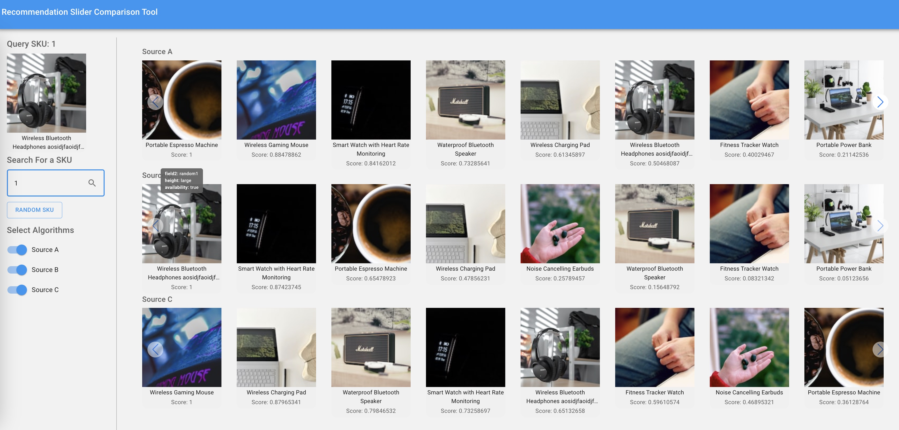

# Recommendations Slider Comparison App



## Available Scripts

In the project directory, you can run:

### `npm install`

Installs all of the dependencies required to run this app

### `npm start`

Runs the app in the development mode.\
Open [http://localhost:3000](http://localhost:3000) to view it in your browser.

The page will reload when you make changes.\
You may also see any lint errors in the console.

## Application

This ReactJS application is a Recommendation Slider Comparison Tool. It allows users to search to input a SKU, and to have multiple sliders on screen to visually inspect the results.

This app currently has separate files to retrieve and parse its SKUs and recommendations. Currently, it uses boilerplate classes, but you can replace it with your API calls, or custom implementation.

It generally requires:

- A list of SKUs with products and attributes where the SKU is the key of the product slug.

```json
{
	"1": {
		"title": "Wireless Bluetooth Headphones ",
		"price": "$69.99",
		"image": "https://source.unsplash.com/random/150x150/?headphones",
		"sku": "1"
	},
	"2": {
		"title": "Smart Watch with Heart Rate Monitoring",
		"price": "$129.99",
		"image": "https://source.unsplash.com/random/150x150/?smartwatch",
		"sku": "2"
	},
...
}
```

- It also expects a result mapping, where the key is the "source" SKU, and the payload contains the SKU of the recommended item, the score (confidence / relevancy / etc.), and any additional data you want to be displayed on a hover tooltip (see screenshot above). In the following example, this would be the result set for SKU 1.

```json
{
	"1": [
		{
		  "sku": 3,
		  "score": 1,
		  "meta": {
		    "field2": "random1",
		    "height": "large",
		    "availability": "true"
		  }
		},
		{
		  "sku": 9,
		  "score": 0.88478862,
		  "meta": {
		    "field2": "random2",
		    "height": "medium"
		  }
		},
```

Please reach out on
